# Delicious Dish
--------------
"Delicious Dish" is a Native Android Mobile Application using java that helps the user plans his weekly meals. It allows the user to view a variety of dishes from all over the world.
 In addition to have the ability of viewing categories, suggesting meals and searching for a specific meal using many options. 

Features :
--------------------
* Splash Screen.
* Login and Register(with simple email and password or with google).
* The user can also choose to remain anonymous and enter as guest by pressing the skip button.
* After Sign up the user can view a multitude of meals in the home page for inspiration.
* Clicking on any meal opens a detailed view with instructions, ingredients and a video that explains how to prepare it.
* Users can search for meals by country or category or ingredient list.
* Opening any meal in search allows the user to see it in a detailed view.
* Logged in users can also add meals to their favourites and view them later. 
* or add the meal to the Calendar and get notified about the meals at a later date.
* User can save favorite meals to browse it later on even without network connectivity.
* User can LogOut.

<h2>Permissions</h2>

- Network Permission.

<h2>Tools </h2>
- Android Studio

- Java

- Retrofit rx 

- TheMealDB Api

- Room rx 

- Firebase

- MVP  

<h2>Contributers:</h2>

- Ahmed Salah Ahmed [linkedin](https://www.linkedin.com/in/ahmed-salah-ahmed-278364207)

- Mai Samir Mohammad [linkedin](https://www.linkedin.com/in/mai-samir-a8204420b)

<h2>- Splash Screen</h2>

  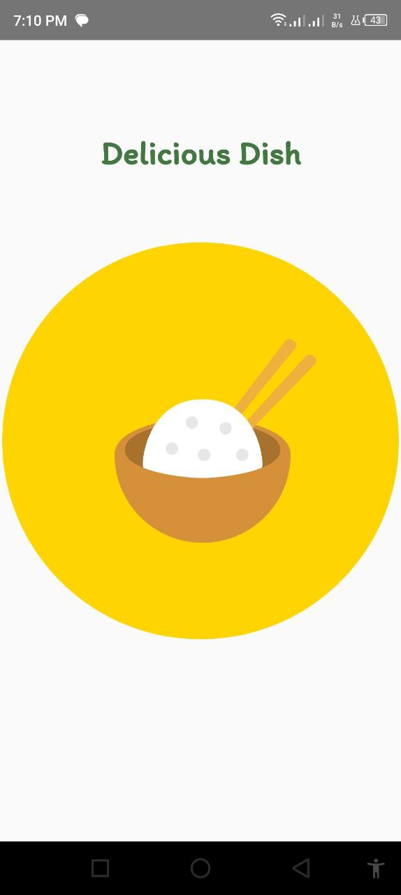
&nbsp; &nbsp; &nbsp; &nbsp;
    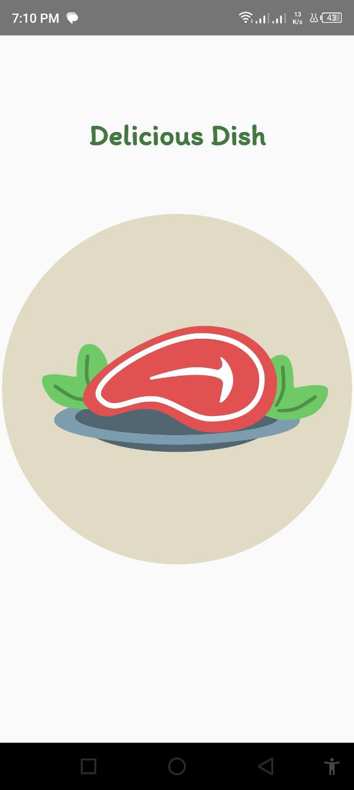

  
  
  
  <h2> - Login and Registeration</h2>
  

    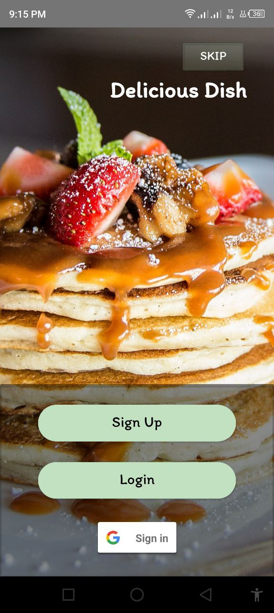
 &nbsp; &nbsp;
    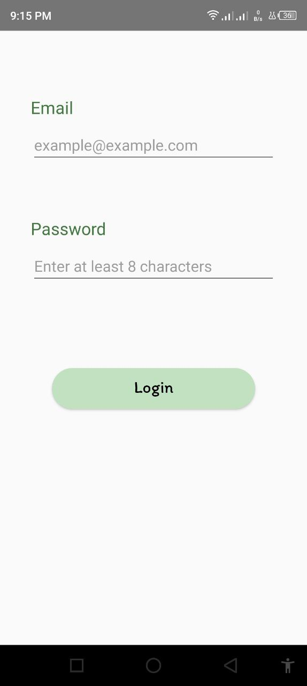
    &nbsp; &nbsp;
    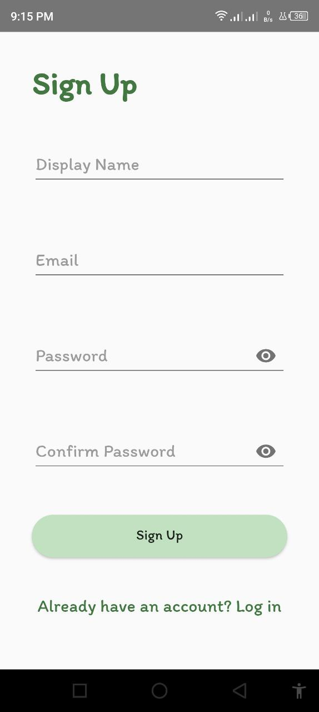
 

 
 
 <h2>- Validate login and Registeration</h2>

  
&nbsp; &nbsp; &nbsp; &nbsp;
    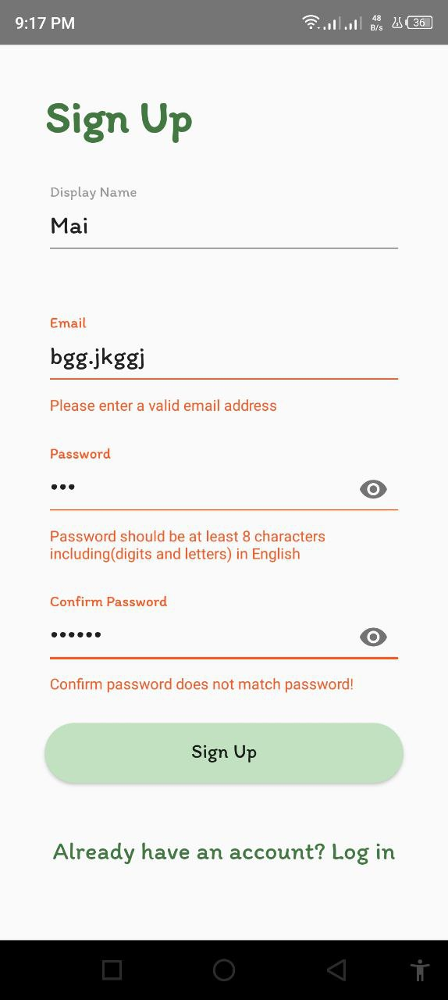

 <h2>- Home Screen (Daily inspiration)</h2>

  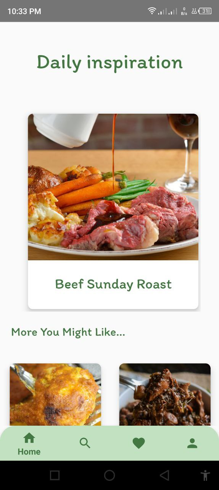

  <h2> - Search by Area, Category or Ingredient</h2>
  

    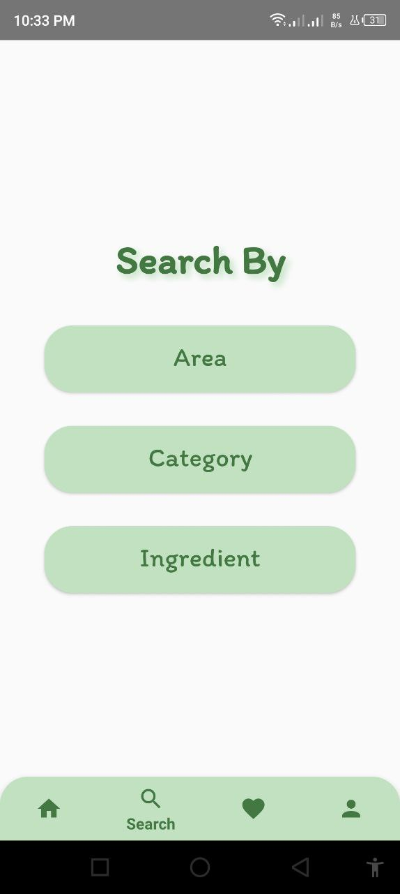
    &nbsp;
    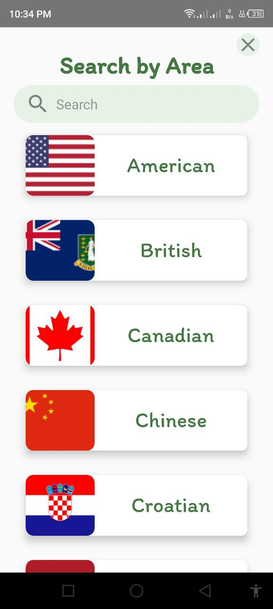
     &nbsp;
    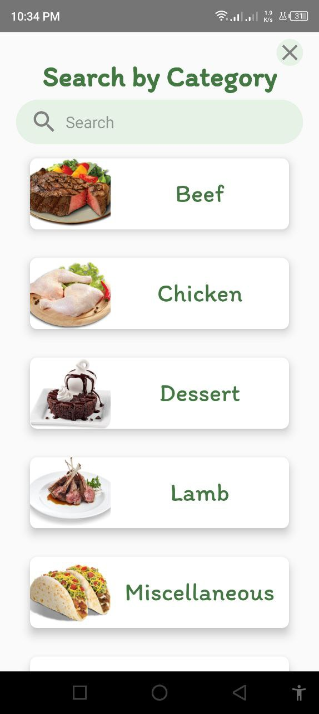
      &nbsp;
    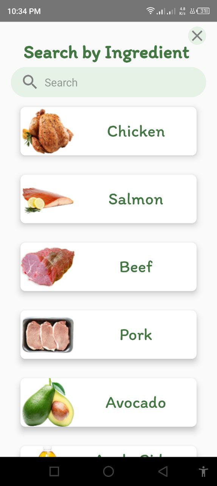
 

  <h2> - Search by specific Area, Category or Ingredient</h2>
  

    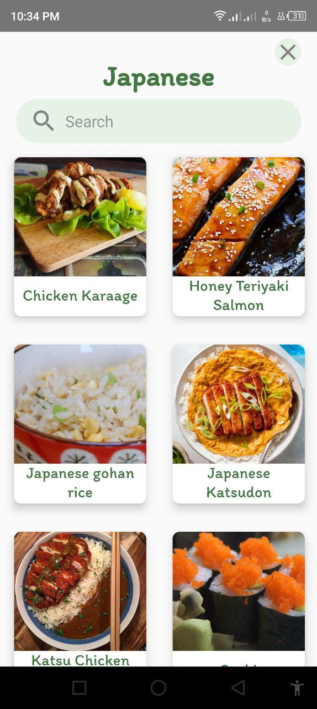
    &nbsp; &nbsp;
    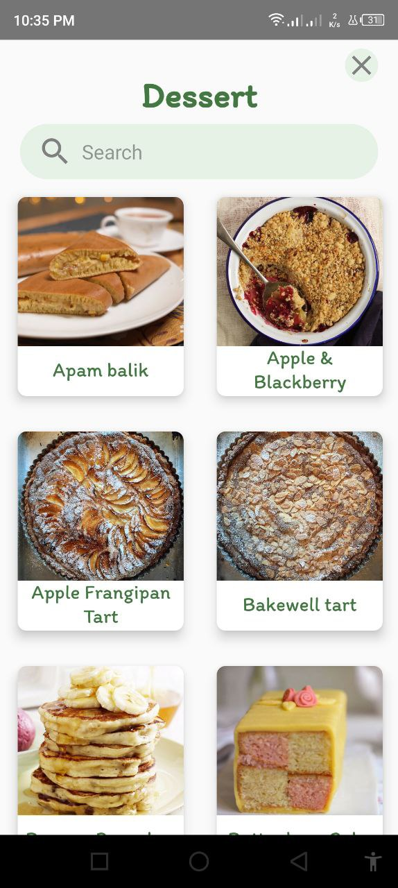
    &nbsp; &nbsp;
    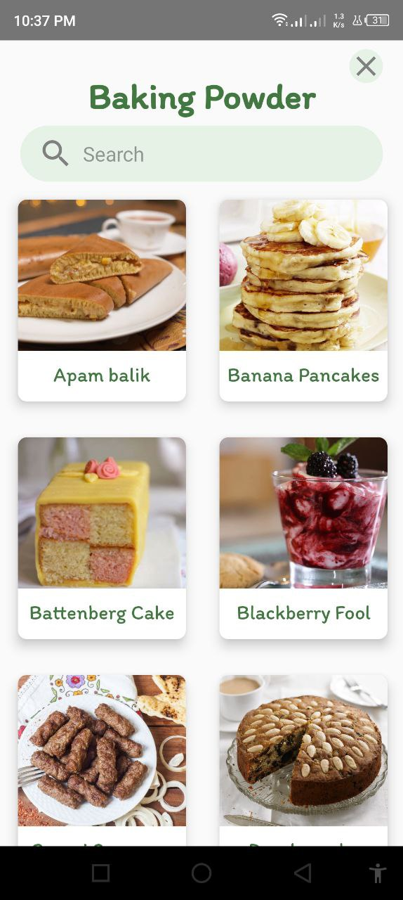
 

 <h2>- Use the search bar to filter the results</h2>

  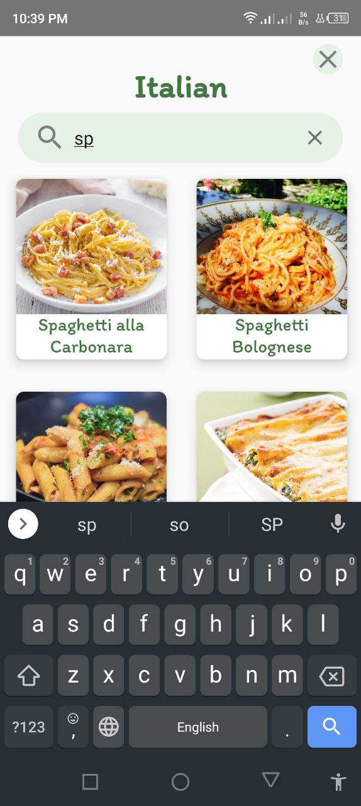

 <h2>- Meal details</h2>

  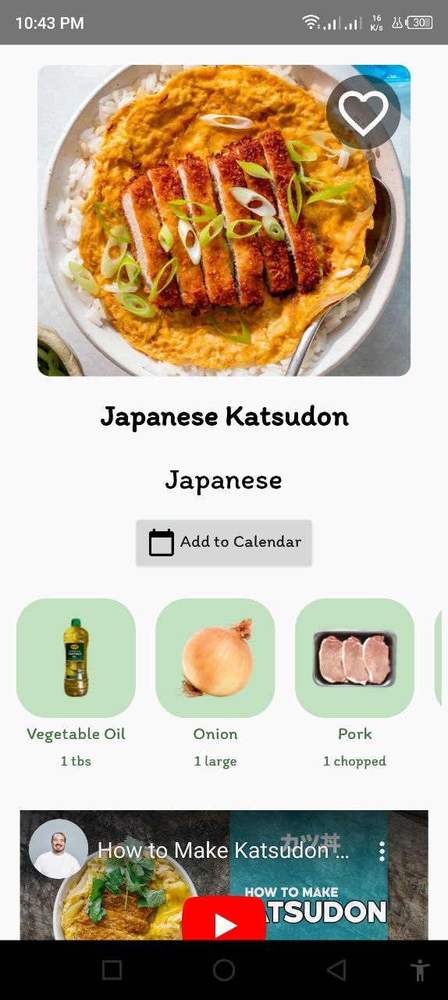
&nbsp; &nbsp; &nbsp; &nbsp;
    

 <h2>- Favorite dishes</h2>

  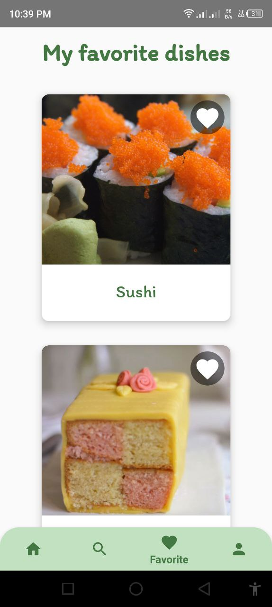

 <h2> - Add to Calender</h2>
  

    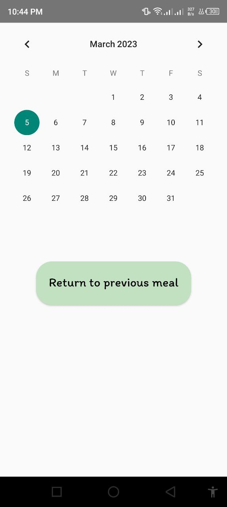
 &nbsp; &nbsp;
    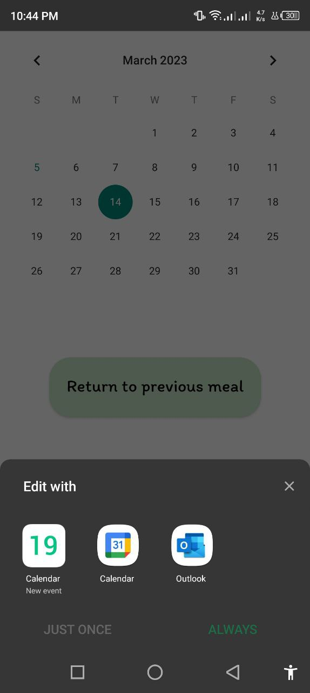
    &nbsp; &nbsp;
    
 

 <h2>- Logout</h2>

  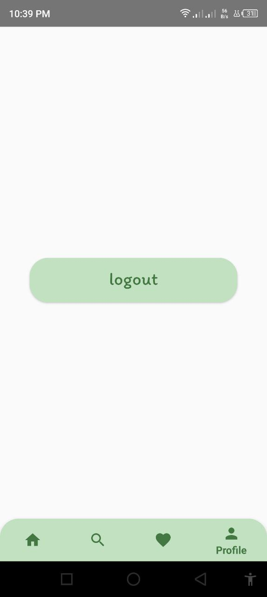

